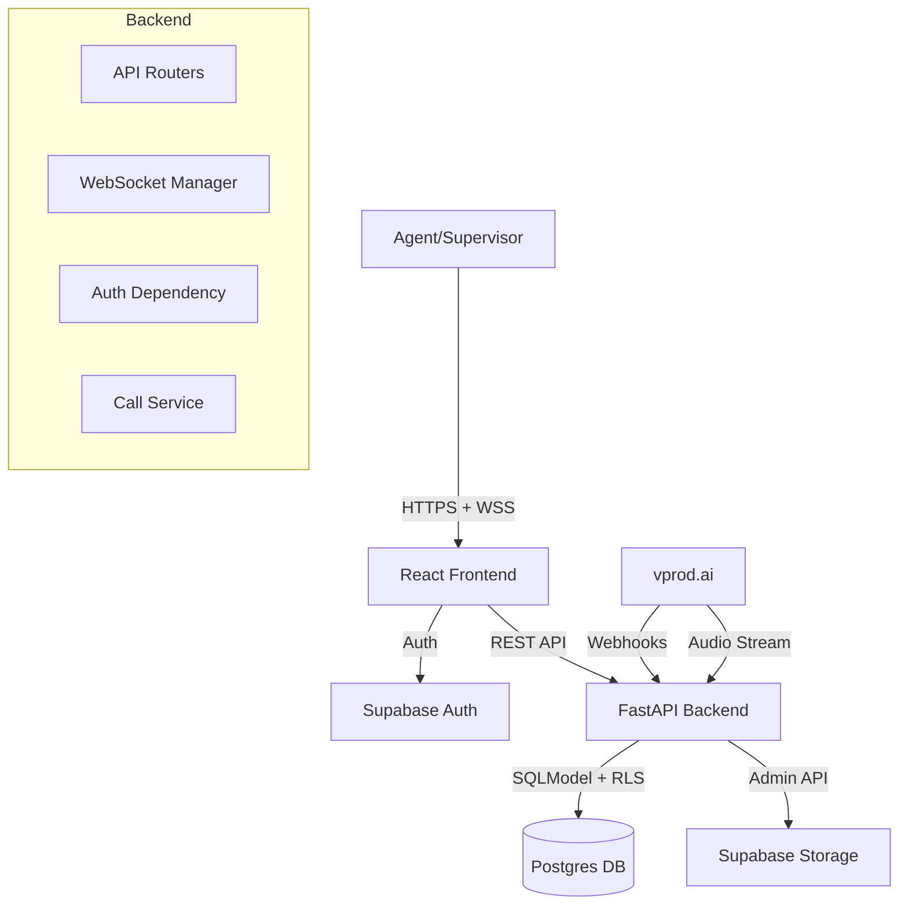
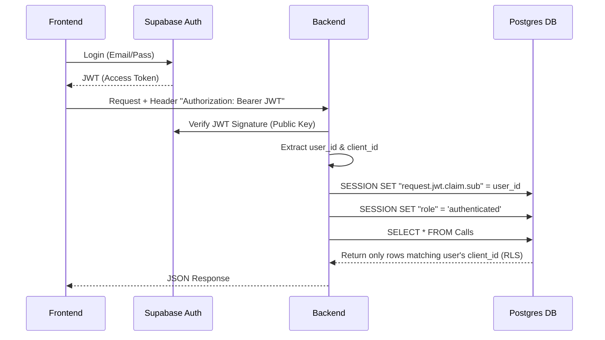
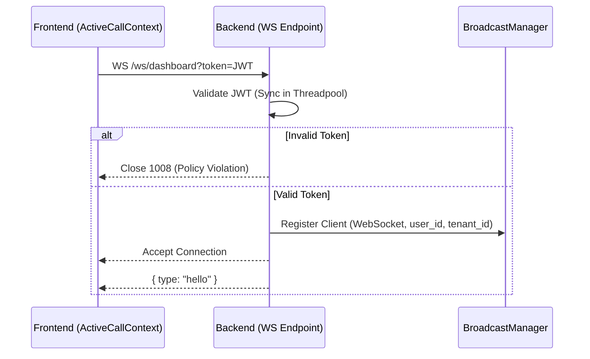
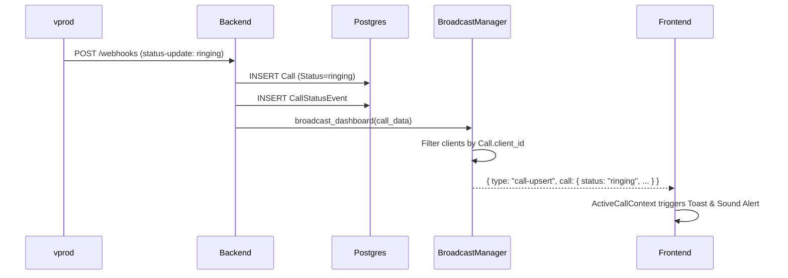
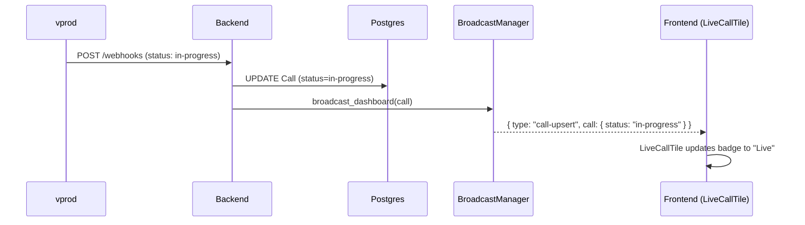
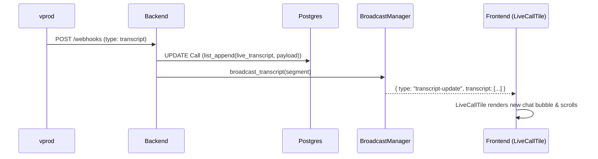
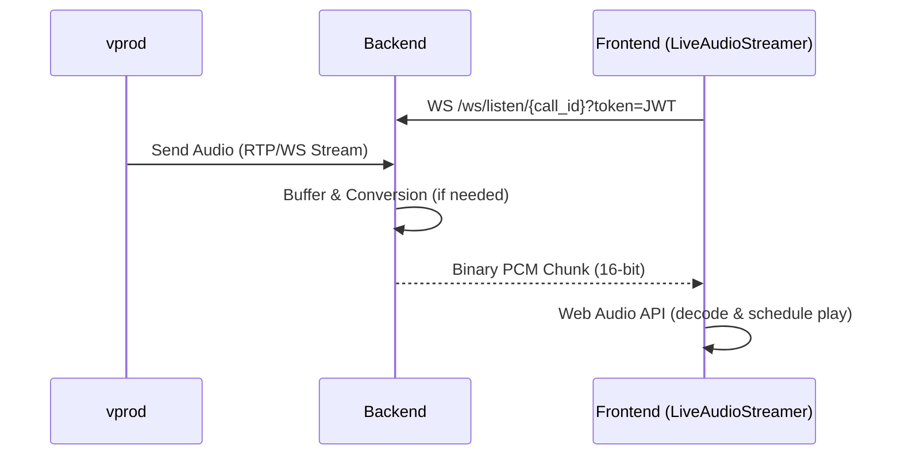
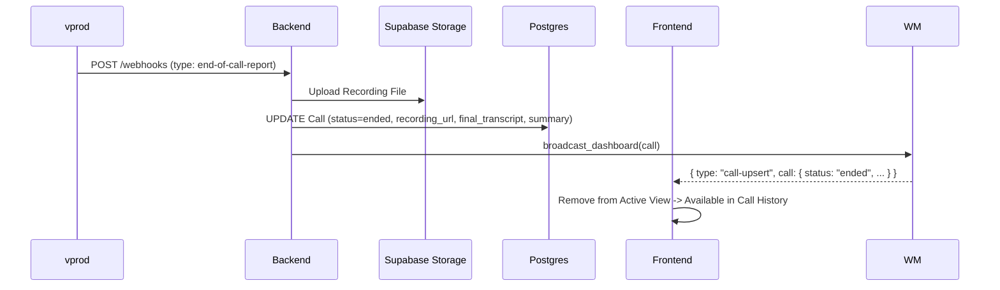
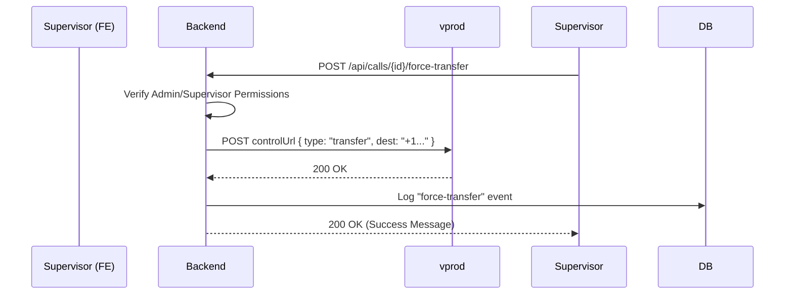

# Architecture Diagrams (Mermaid)

## 1. High-Level System Components
Overview of how Frontend, Backend, Database, and vprod interact.

## 2. Authentication & RLS Flow
How requests are authenticated and authorized using Row Level Security.

## 3. WebSocket Dashboard Connection
Establishing the real-time link for call updates.

## 4. New Call Lifecycle (Incoming)
A new call starts ringing at vprod.

## 5. Status Update Flow (In-Progress)
Call is answered and becomes active.

## 6. Live Transcript Streaming
Real-time text updates during the call.

## 7. Audio Streaming (Listen In)
Low-latency audio monitoring via Web Audio API.

## 8. End of Call Report & Recording
Finalizing the call and securing artifacts.

## 9. Force Transfer Flow (Supervisor Action)
Manually taking over a call.

