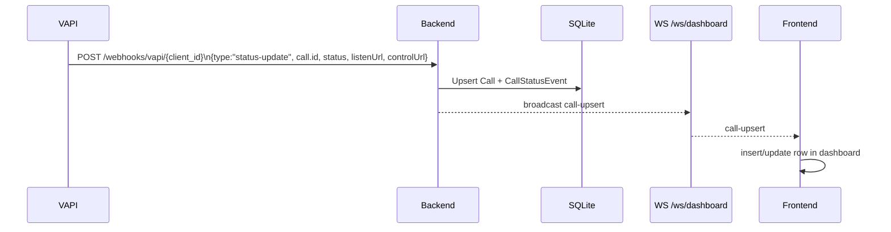
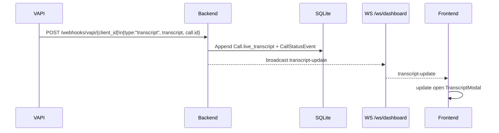
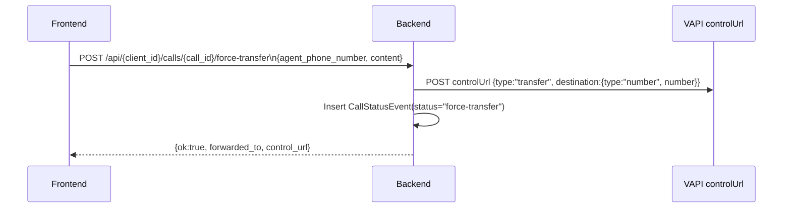

# Architecture Diagrams (Mermaid)

## High-Level Components
```mermaid
flowchart TD
  subgraph VAPI
    WB[Vapi webhook\nPOST /webhooks/vapi/{client_id}]
    LS[listenUrl WS\n(binary PCM)]
    CTL[controlUrl\nHTTP POST]
  end

  subgraph Backend[FastAPI]
    API[/REST + Webhooks/]
    WS[/WS /ws/dashboard/]
    FAKE[/WS /ws/fake-audio/]
    DB[(SQLite / SQLModel)]
  end

  subgraph Frontend[React + Vite + Tailwind]
    UI[CallDashboard]
    LModal[ListenModal]
    TModal[TranscriptModal]
  end

  WB --> API
  API --> DB
  API --> WS
  DB --> WS
  WS --> UI
  UI --> WS
  LModal --> LS
  UI --> CTL
  LModal --> FAKE
```

## Status Update Flow


## Transcript Flow


## End-of-Call Report Flow
```mermaid
sequenceDiagram
  participant V as VAPI
  participant B as Backend
  participant DB as SQLite
  participant W as WS /ws/dashboard
  participant F as Frontend

  V->>B: POST /webhooks/vapi/{client_id}\n{type:"end-of-call-report", artifact.recording, artifact.transcript, call.id}
  B->>DB: Set status=ended, ended_at, final_transcript, recording_url, summary; log CallStatusEvent
  B-->>W: broadcast call-upsert (hasTranscript/hasRecording flags)
  W-->>F: call-upsert
  F->>F: render ended state (recording/transcript actions)
```

## Force Transfer Flow

