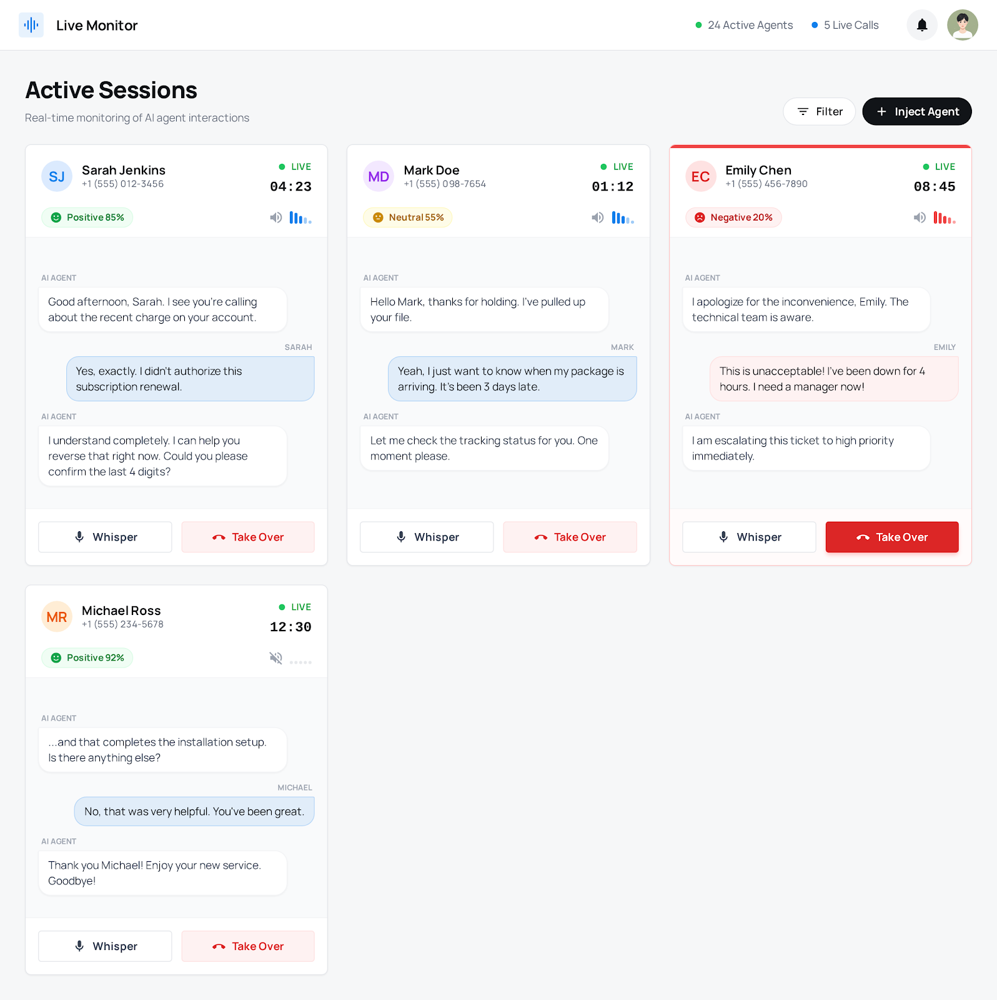
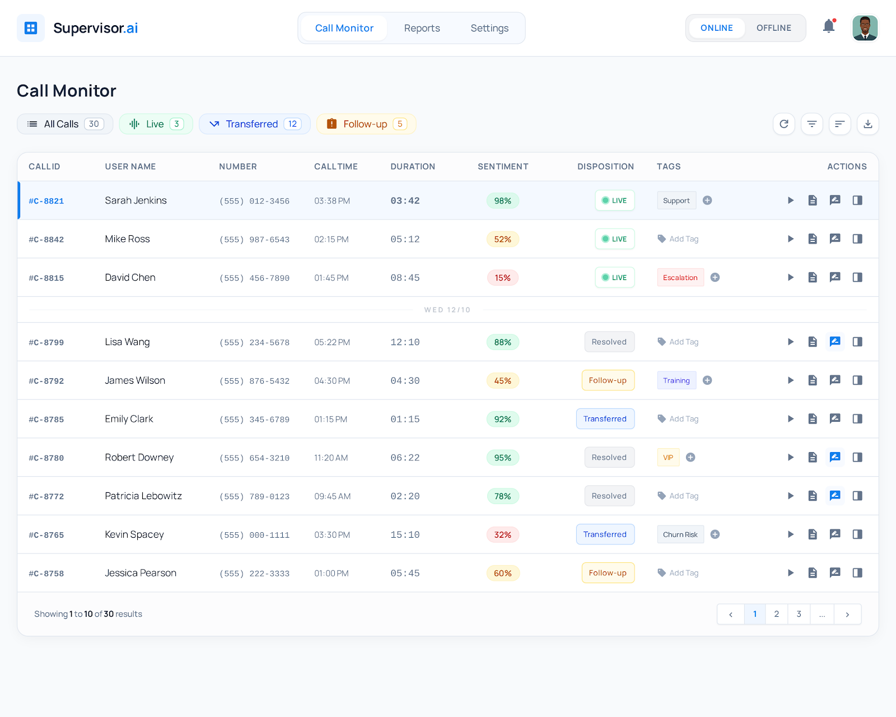
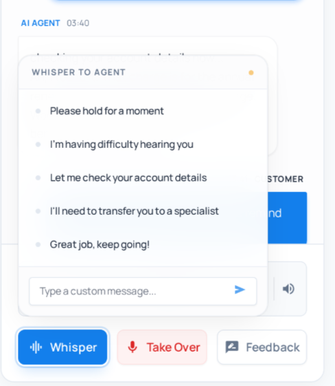
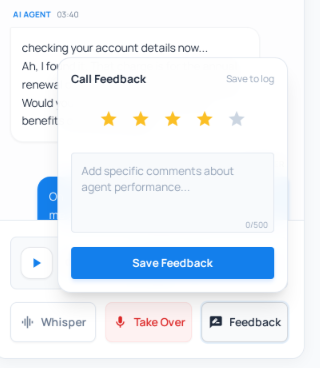

# CallMark AI — Inbound Call Dashboard

> Real-time monitoring for AI voice agents powered by [vprod.ai](https://vprod.ai)

**Navigation** → [Story](#the-story-behind-callmark-ai) | [Live Demo](#live-demo) | [Features](#features-walkthrough) | [How It Works](#architecture--how-it-works) | [Tech Stack](#tech-stack) | [Repo Map](#repository-map) | [Quick Start](#quick-start) | [Data Model](#data-model) | [Security](#architecture--security) | [API Docs](#api-documentation) | [Operations](#operational-notes)

---

## The Story Behind CallMark AI

A Medicare agency came to us with a real problem: how do you cut call center costs without sacrificing the customer experience? Every AI solution they tried had the same failure mode — 2 out of 10 calls would go sideways, leaving distressed customers and a damaged reputation.

**CallMark AI was built to bridge that gap.** Rather than replacing human agents, we elevate them to supervisors. AI handles the routine volume; humans stay in the loop and step in when it matters.

### The Result

- **Up to 70% cost reduction** — fewer agents handling more calls
- **Better customer satisfaction** — human empathy is always one click away
- **Shorter wait times** — AI never goes on break

---

## Live Demo

Try CallMark AI right now by calling one of our live AI agents:

| Use Case | Phone Number |
| :--- | :--- |
| Medicare Inquiries | [938-204-1672](tel:9382041672) |
| Final Expense Insurance | [786-605-3428](tel:7866053428) |
| Personal Loan Inquiries | [938-204-1772](tel:9382041772) |

---

## Features Walkthrough

### 1. Live Call Monitor


Monitor every active call in real-time. Supervisors can listen in and step in when the AI needs a hand.

### 2. Call Logs


Access detailed, searchable logs for every call — perfect for auditing, QA, and agent training.

### 3. Whisper Notes


Send real-time guidance to the AI mid-call with pre-set whisper prompts.

### 4. Feedback Loop


Rate calls and provide structured feedback to continuously improve AI performance.

---

## Architecture & How It Works

### High-Level Flow

```
[Customer] → [vprod.ai] → [Webhook] → [FastAPI Backend] → [Supabase DB]
                ↓                                    ↓
           [WebSocket] ← ← ← ← ← ← ← ← ← ← ← [React Frontend]
```

1. **Inbound Call**: Customer calls a vprod.ai phone number
2. **Webhook**: vprod sends events (status, transcript, end-of-call) to our backend
3. **Processing**: Backend stores data in Supabase, broadcasts via WebSocket
4. **Real-Time UI**: Frontend receives updates instantly — no refresh needed
5. **Supervisor**: Human can listen in, whisper notes, or force-transfer to a human agent

### Component Overview

| Component | Responsibility |
| :--- | :--- |
| **FastAPI Backend** | Webhook ingestion, REST API, WebSocket server, auth middleware |
| **Supabase** | PostgreSQL database, Row Level Security, Auth, Storage (recordings) |
| **React Frontend** | Real-time dashboard, call monitoring, transcript display |
| **vprod.ai** | Voice AI agent, SIP trunking, transcription, recording |

---

## Tech Stack

### Frontend
- **Framework**: React 18 + TypeScript
- **Build Tool**: Vite
- **Styling**: Tailwind CSS + shadcn/ui components
- **State**: React Context + WebSocket subscriptions
- **Deployment**: Vercel (or Docker → any container host)

### Backend
- **Framework**: FastAPI (Python 3.10+)
- **ORM**: SQLModel
- **Database**: PostgreSQL (via Supabase)
- **Auth**: Supabase Auth (JWT)
- **Real-Time**: WebSocket (FastAPI native)
- **Deployment**: Render (or Docker → any container host)

### Infrastructure
- **Database**: Supabase (PostgreSQL + RLS)
- **Storage**: Supabase Storage (call recordings)
- **Voice AI**: vprod.ai

---

## Repository Map

```
fe-inbound-panel/
├── backend/
│   ├── app.py                 # FastAPI entry point, lifespan, middleware
│   ├── requirements.txt       # Python dependencies
│   ├── Dockerfile
│   ├── routers/
│   │   ├── calls.py           # REST endpoints for call CRUD
│   │   ├── webhooks.py        # vprod.ai webhook dispatcher
│   │   └── websockets.py      # WebSocket endpoint handlers
│   ├── services/
│   │   ├── call_service.py    # Business logic for call operations
│   │   ├── sentiment_service.py
│   │   ├── supabase_service.py
│   │   └── websocket_manager.py
│   ├── dependencies/
│   │   ├── auth.py            # get_current_user dependency
│   │   ├── auth_utils.py      # Token decoding, client_id extraction
│   │   └── ws_auth.py         # WebSocket auth helper
│   └── database/
│       ├── connection.py      # SQLModel session setup
│       ├── models.py          # SQLModel classes (Call, Profile)
│       └── migrations/        # SQL migration files
├── frontend/
│   ├── src/
│   │   ├── pages/
│   │   │   ├── LandingPage.tsx    # Marketing hero page
│   │   │   ├── DashboardPage.tsx  # Main call log view
│   │   │   ├── LiveMonitorPage.tsx
│   │   │   └── ...
│   │   ├── components/
│   │   │   ├── LiveCallTile.tsx
│   │   │   ├── CallDetailSidebar.tsx
│   │   │   ├── ListenModal.tsx
│   │   │   └── ...
│   │   ├── lib/
│   │   │   └── supabase.ts    # Supabase client init
│   │   └── context/
│   │       └── ActiveCallContext.tsx
│   ├── package.json
│   ├── vite.config.ts
│   └── Dockerfile
├── demo-images/               # Screenshots for README
├── docker-compose.yml         # Local dev environment
└── README.md                  # This file
```

---

## Quick Start

### Prerequisites

- Node.js 18+
- Python 3.10+
- Docker & Docker Compose (optional)
- Supabase project (free tier works)

### Option A: Docker Compose (Recommended)

```bash
# Clone and run
docker-compose up --build

# Frontend → http://localhost:5173
# Backend  → http://localhost:8000
```

### Option B: Manual Run

**Backend:**

```bash
cd backend
python -m venv venv
source venv/bin/activate  # or venv\Scripts\activate on Windows
pip install -r requirements.txt

# Set env vars
export SUPABASE_URL="https://your-project.supabase.co"
export SUPABASE_KEY="your-service-role-key"
export WEBHOOK_SECRET="your-secret"

uvicorn app:app --reload --port 8000
```

**Frontend:**

```bash
cd frontend
npm install
npm run dev
```

---

## Data Model

### Calls Table

| Column | Type | Description |
| :--- | :--- | :--- |
| `id` | UUID | Primary key (vprod call ID) |
| `client_id` | TEXT | Tenant identifier (RLS filter) |
| `phone_number` | TEXT | Customer's phone number |
| `status` | TEXT | `ringing`, `in-progress`, `ended` |
| `started_at` | TIMESTAMP | When call was initiated |
| `ended_at` | TIMESTAMP | When call finished |
| `duration` | INT | Duration in seconds |
| `listen_url` | TEXT | WebSocket URL for live audio |
| `control_url` | TEXT | HTTP endpoint for transfer |
| `live_transcript` | JSONB | Array of `{role, text}` objects |
| `final_transcript` | TEXT | Full transcript after call ends |
| `summary` | TEXT | AI-generated call summary |
| `sentiment` | TEXT | `positive`, `neutral`, `negative` |
| `recording_url` | TEXT | Supabase Storage URL |
| `notes` | TEXT | Supervisor notes |
| `feedback_rating` | INT | 1-5 star rating |

### Profiles Table

| Column | Type | Description |
| :--- | :--- | :--- |
| `id` | UUID | FK to auth.users |
| `email` | TEXT | User email |
| `client_id` | TEXT | Tenant ID |
| `role` | TEXT | `admin`, `supervisor`, `agent` |

---

## Architecture & Security

### Authentication Flow

1. **Login**: User authenticates via Supabase Auth (email/password or magic link)
2. **Token**: Supabase returns a JWT access token
3. **Header**: Client includes `Authorization: Bearer <token>` on every API request
4. **Validation**: FastAPI dependency `get_current_user` decodes token, extracts `client_id`
5. **RLS**: All queries include `WHERE client_id = :current_client_id`

### Row Level Security (RLS)

```sql
-- Enable RLS on calls table
ALTER TABLE calls ENABLE ROW LEVEL SECURITY;

-- Policy: users can only see their tenant's calls
CREATE POLICY "Tenant isolation" ON calls
  FOR SELECT USING (client_id = current_setting('app.client_id', true));
```

### Webhook Security

- vprod.ai webhook calls include a secret token in the `Authorization` header
- Backend validates this before processing any webhook payload

---

## API Documentation

### Base URL
`http://localhost:8000` (Development)

---

### 1. Authentication & Security

**Overview:** This API uses **Supabase Auth (JWT)** for authentication and **PostgreSQL Row Level Security (RLS)** for authorization. All requests to protected endpoints MUST include the JWT in the `Authorization` header.

**Header Format:**
```http
Authorization: Bearer <your_access_token>
```

**Multi-Tenancy & RLS:**
- **Isolation**: Data access is strictly isolated by `client_id` (Tenant ID).
- **Enforcement**: The backend extracts the `client_id` from the JWT's `app_metadata` (via custom claims or profile lookup) and sets a Postgres Session variable.
- **Rule**: `SELECT * FROM calls` only returns rows where `client_id` matches the user's `client_id`.

---

### 2. Webhooks (vprod Ingestion)

#### `POST /webhooks/vprod/{client_id}`

Dispatcher for all vprod.ai server events. This endpoint is **protected** and requires a secret token.

**Headers:**
- `Content-Type`: `application/json`
- `Authorization`: `Bearer <WEBHOOK_SECRET>`

#### Scenario A: Status Update

Sent when call state changes (e.g., `ringing` -> `in-progress` -> `ended`).

**Sample Payload:**
```json
{
  "message": {
    "type": "status-update",
    "status": "in-progress",
    "call": {
      "id": "vprod-call-uuid-123",
      "customer": { "number": "+15550001234" },
      "listenUrl": "wss://vprod.ai/listen/...",
      "controlUrl": "https://vprod.ai/control/..."
    },
    "timestamp": "2024-01-01T12:00:00Z"
  }
}
```

#### Scenario B: Live Transcript

Sent incrementally as the AI or user speaks.

**Sample Payload:**
```json
{
  "message": {
    "type": "transcript",
    "transcript": "Hello, how can I help you today?",
    "transcriptType": "partial", 
    "call": { "id": "vprod-call-uuid-123" }
  }
}
```

#### Scenario C: End of Call Report

Sent after the call finishes processing.

**Sample Payload:**
```json
{
  "message": {
    "type": "end-of-call-report",
    "call": { "id": "vprod-call-uuid-123" },
    "artifact": {
      "transcript": "Full final transcript...",
      "recordingUrl": "https://vprod.ai/recordings/file.wav"
    },
    "analysis": {
      "summary": "User asked about billing.",
      "sentiment": "positive"
    },
    "endedReason": "customer-ended-call"
  }
}
```

---

### 3. REST API (Calls)

#### List Calls

**`GET /api/{client_id}/calls`**

Retrieve a paginated/filtered list of calls.

**Query Parameters:**
- `status` (optional): Filter by comma-separated status (e.g., `in-progress,ringing`).
- `include_content` (optional): `true` to return full transcripts and summaries. Defaults to `false`.

**Example Request:**
```bash
curl -X GET "http://localhost:8000/api/demo-client/calls?status=in-progress" \
     -H "Authorization: Bearer <your_jwt>"
```

**Response (200 OK):**
```json
[
  {
    "id": "vprod-call-uuid-123",
    "client_id": "demo-client",
    "phone_number": "+15550001234",
    "status": "in-progress",
    "started_at": "2024-01-01T12:00:00Z",
    "duration": 45,
    "hasListenUrl": true,
    "hasLiveTranscript": true,
    "hasFinalTranscript": false
  }
]
```

#### Get Call Details

**`GET /api/calls/{call_id}`**

Retrieve full details for a single call, including the live transcript array and analysis.

**Example Request:**
```bash
curl -X GET "http://localhost:8000/api/calls/vprod-call-uuid-123" \
     -H "Authorization: Bearer <your_jwt>"
```

**Response (200 OK):**
```json
{
  "id": "vprod-call-uuid-123",
  "client_id": "demo-client",
  "status": "in-progress",
  "live_transcript": [
    { "role": "ai", "text": "Hello!" },
    { "role": "user", "text": "Hi there." }
  ],
  "final_transcript": null,
  "summary": null,
  "sentiment": "neutral"
}
```

#### Force Transfer (Take Over)

**`POST /api/{client_id}/calls/{call_id}/force-transfer`**

Triggers a transfer event to the vprod `controlUrl`. Requires **Admin** role or Call Ownership.

**Example Request:**
```bash
curl -X POST "http://localhost:8000/api/demo-client/calls/vprod-uuid-123/force-transfer" \
     -H "Authorization: Bearer <your_jwt>" \
     -H "Content-Type: application/json" \
     -d '{
           "agent_phone_number": "+15559998888",
           "content": "Transferring you to a specialist."
         }'
```

**Response (200 OK):**
```json
{
  "ok": true,
  "call_id": "vprod-uuid-123",
  "forwarded_to": "+15559998888"
}
```

#### Get Recording URL

**`GET /api/calls/{call_id}/recording`**

Generates a secure, time-limited Signed URL for the recording file stored in Supabase Storage.

**Example Request:**
```bash
curl -X GET "http://localhost:8000/api/calls/vprod-uuid-123/recording" \
     -H "Authorization: Bearer <your_jwt>"
```

**Response (200 OK):**
```json
{
  "url": "https://<supabase-project>.supabase.co/storage/v1/object/sign/recordings/file.wav?token=..."
}
```

#### Update Call Metadata

**`PATCH /api/calls/{call_id}`**

Updates editable fields like notes or feedback ratings.

**Example Request:**
```bash
curl -X PATCH "http://localhost:8000/api/calls/vprod-uuid-123" \
     -H "Authorization: Bearer <your_jwt>" \
     -H "Content-Type: application/json" \
     -d '{ "notes": "Customer was frustrated.", "feedback_rating": 2 }'
```

---

### 4. WebSockets (Real-Time)

#### Dashboard Updates

**URL**: `ws://localhost:8000/ws/dashboard?token=<JWT>`

**Protocol:**
1.  **Connect**: Client sends JWT in query param.
2.  **Server Hello**: Server sends `{ "type": "hello" }`.
3.  **Subscriptions**: Client can send `{ "type": "subscribe", "callId": "..." }` to get granular transcript updates.
4.  **Broadcasts**:
    -   **`call-upsert`**: Pushed whenever a call's status or metadata changes.
    -   **`transcript-update`**: Pushed when new speech is transcribed.

**Sample `transcript-update` Message:**
```json
{
  "type": "transcript-update",
  "clientId": "demo-client",
  "callId": "vprod-uuid-123",
  "append": " I would like to order...",
  "fullTranscript": "Hello... I would like to order..." 
}
```

#### Audio Streaming (Listen In)

**URL**: `ws://localhost:8000/ws/listen/{call_id}?token=<JWT>`

**Protocol:**
-   **Binary Stream**: The server proxies binary messages from vprod's `listenUrl`.
-   **Format**: Raw **PCM 16-bit Little Endian**.
-   **Sample Rate**: Typically 24kHz or 32kHz (depends on vprod configuration).
-   **Client Side**: Use Web Audio API `AudioContext` to decode and play.

---

### 5. Error Codes

| Status Code | Description |
| :--- | :--- |
| `200 OK` | Request succeeded. |
| `400 Bad Request` | Missing required fields or invalid JSON. |
| `401 Unauthorized` | Missing or invalid Bearer token. |
| `403 Forbidden` | Valid token, but user does not have access to the resource (Tenant mismatch). |
| `404 Not Found` | Resource does not exist or user is hidden from it via RLS. |
| `500 Internal Error` | Server-side exception. |

---

## Operational Notes

### Environment Variables

| Variable | Required | Description |
| :--- | :--- | :--- |
| `SUPABASE_URL` | Yes | Supabase project URL |
| `SUPABASE_KEY` | Yes | Service role key (or anon key with RLS) |
| `WEBHOOK_SECRET` | Yes | Secret token for vprod webhooks |
| `ENV` | No | `development` or `production` |

### Supabase Setup

1. Create a new Supabase project
2. Run the migrations in `backend/database/migrations/`
3. Enable RLS on the `calls` table
4. Create a service role key with permission to bypass RLS (for backend only)

### vprod.ai Configuration

1. Sign up at [vprod.ai](https://vprod.ai)
2. Configure your webhook URL: `https://your-backend.com/webhooks/vprod/{client_id}`
3. Set the webhook secret in both vprod and your backend env vars

---

## License

MIT — feel free to use, modify, and distribute.

---

**Built with ❤️ to enhance customer experiences.**