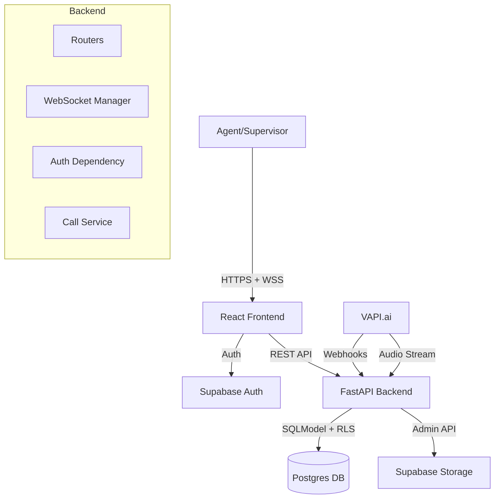
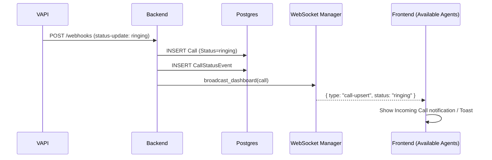
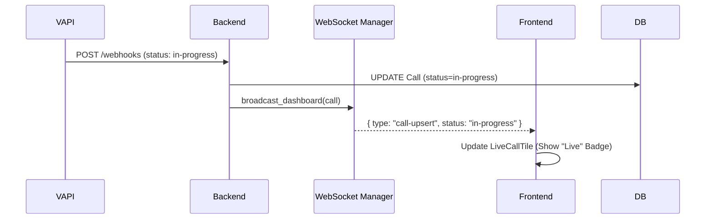
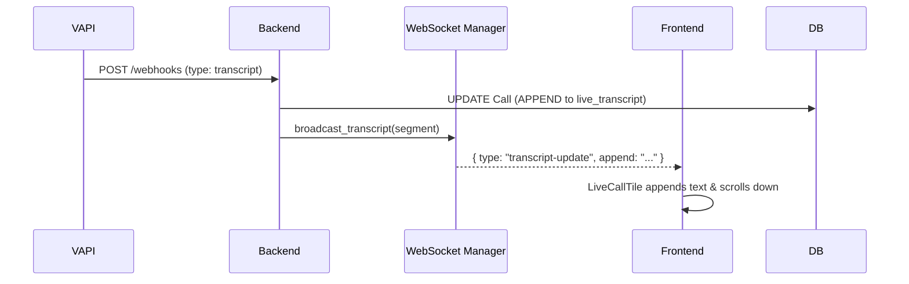
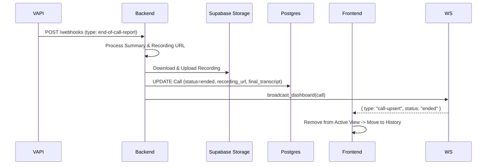
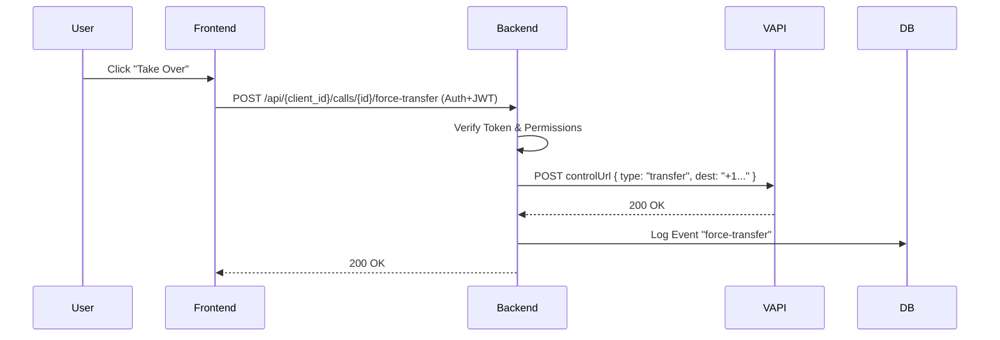

# CallMark AI Inbound Call Dashboard

**Real-time monitoring for AI voice agents powered by [VAPI.ai](https://vapi.ai).**

This application provides a comprehensive dashboard for tracking active and historical calls. It uses specialized WebSockets for real-time state synchronization and audio streaming, and leverages Supabase for secure authentication and data persistence.


*(Note: Add a screenshot here locally if desired)*

---

## Repository Map

## Repository Map

### `backend/` (FastAPI + SQLModel)
- **`app.py`**: Main application entry point. Configures middleware (CORS, HSTS).
- **`routers/`**:
    - `webhooks.py`: Ingests VAPI events (status-update, transcript, end-of-call).
    - `calls.py`: REST endpoints for listing/retrieving calls.
    - `websockets.py`: Handlers for dashboard updates (`/ws/dashboard`) and audio streaming (`/ws/listen`).
- **`services/`**:
    - `websocket_manager.py`: `BroadcastManager` class. Handles connection pooling and tenant-based message isolation.
    - `call_service.py`: Core logic for upserting calls and processing reports.
    - `supabase_service.py`: Interfaces with Supabase Storage for recordings.
    - `create_user.py`: **Admin Script** for creating new users in Supabase Auth & Postgres.
- **`dependencies/`**:
    - `auth.py`: JWT validation and **Row Level Security (RLS)** context switching.
    - `ws_auth.py`: Query-param based auth for WebSockets.
- **`database/`**:
    - `models.py`: SQLModel definitions (`Call`, `Client`, `CallStatusEvent`, `Profile`).
    - `connection.py`: Database session management and engine configuration.
- **`migrations/`**: Alembic migration scripts for database schema versioning.

### `frontend/` (React + Vite + Tailwind v4)
- **`src/context/`**:
    - **`ActiveCallContext.tsx`**: Singleton WebSocket manager. (See "Frontend Architecture" below).
    - **`GlobalContext.tsx`**: User session and theme state.
- **`src/components/`**:
    - **`Sidebar.tsx`**: Layout shell with navigation and **real-time active call badge**.
    - **`LiveCallTile.tsx`**: Real-time card for in-progress calls. Includes `LiveAudioStreamer`.
    - **`LiveAudioStreamer.tsx`**: Web Audio API consumer for low-latency audio playback.
    - **`CallDashboard.tsx`**: Main data table for call logs with filtering/sorting.
    - **`CallDetailSidebar.tsx`**: Deep-dive view for call transcripts and analysis.
- **`src/pages/`**:
    - **`LiveMonitorPage.tsx`**: "Active Calls" view. Subscribes to `ActiveCallContext`.
    - **`CallDashboard.tsx`**: Historical call logs.
    - **`LoginPage.tsx`**: Supabase Auth login.

---

## Quick Start

### Prerequisites
- Python 3.11+
- Node.js 20+
- [Supabase Project](https://supabase.com) (Postgres DB + Auth)

### 1. Backend Setup
```bash
cd backend
python -m venv .venv
source .venv/bin/activate  # Windows: .venv\Scripts\activate
pip install -r requirements.txt
```

**Environment Variables (`backend/.env`)**
```ini
DATABASE_URL=postgresql://postgres:[PASSWORD]@[HOST]:5432/postgres
SUPABASE_URL=https://[PROJECT-ID].supabase.co
# Service Key used ONLY for admin scripts & webhooks (Bypasses RLS)
SUPABASE_SERVICE_ROLE_KEY=[SECRET-KEY]
# Anon Key used for client-side scoped requests (Respects RLS)
SUPABASE_ANON_KEY=[PUBLIC-KEY]
```

**Run Server**
```bash
python -m uvicorn app:app --reload --port 8000
```

### 2. Frontend Setup
```bash
cd frontend
npm install
```

**Environment Variables (`frontend/.env`)**
```ini
VITE_BACKEND_URL=http://localhost:8000
VITE_SUPABASE_URL=https://[PROJECT-ID].supabase.co
VITE_SUPABASE_ANON_KEY=[PUBLIC-KEY]
```

**Run Client**
```bash
npm run dev
```

### 3. Creating a User
Use the helper script to create a user in both Supabase Auth and your local Profiles table:
```bash
cd backend
# Run as module to ensure imports work
python -m services.create_user
```
Follow the interactive prompts to set email, password, and `client_id` (Tenant ID).

---

## Data Model (Postgres/SQLModel)

### 1. `Client` Table
Represents a Tenant or Organization.
| Column | Type | Description |
| :--- | :--- | :--- |
| `id` | `VARCHAR(PK)` | Manual ID (e.g. "demo-client") |
| `name` | `VARCHAR` | Display Name |
| `created_at` | `TIMESTAMP` | Creation time |

### 2. `Profile` Table (`public.profiles`)
Links Auth Users to Clients.
| Column | Type | Description |
| :--- | :--- | :--- |
| `id` | `UUID(PK)` | References `auth.users.id` |
| `client_id` | `VARCHAR` | References `Client.id` |
| `role` | `VARCHAR` | `admin` or `user` |
| `username` | `VARCHAR` | Unique username |
| `display_name` | `VARCHAR` | Human readable name |
| `created_at` | `TIMESTAMP` | |

### 3. `Call` Table
The core record for voice sessions.
| Column | Type | Description |
| :--- | :--- | :--- |
| `id` | `VARCHAR(PK)` | VAPI Call ID |
| `client_id` | `VARCHAR(FK)` | Tenant Reference |
| `phone_number` | `VARCHAR` | Caller's Number |
| `status` | `VARCHAR` | `in-progress`, `ended`, `ringing`, `queued` |
| `started_at` | `TIMESTAMP` | Call Start Time |
| `ended_at` | `TIMESTAMP` | Call End Time |
| `duration` | `INTEGER` | Duration in seconds |
| `user_id` | `VARCHAR` | Assigned Agent ID |
| `username` | `VARCHAR` | Assigned Agent Name |
| `cost` | `FLOAT` | VAPI Cost |
| `listen_url` | `VARCHAR` | WebSocket URL for audio |
| `control_url` | `VARCHAR` | HTTP URL for call controls |
| **`live_transcript`** | `TEXT` | JSON Array (Incremental updates) |
| **`final_transcript`** | `TEXT` | Complete transcript blob |
| `recording_url` | `VARCHAR` | Path in `recordings` bucket |
| `summary` | `JSON` | AI Summary object |
| `sentiment` | `VARCHAR` | Overall sentiment |
| `disposition` | `VARCHAR` | Call outcome (e.g. "qualified") |
| `notes` | `TEXT` | Agent notes |
| `feedback_rating` | `INTEGER` | 1-5 Rating |
| `feedback_text` | `TEXT` | Feedback comments |
| `created_at` | `TIMESTAMP` | |
| `updated_at` | `TIMESTAMP` | |

### 4. `CallStatusEvent` Table
Audit log of all call state changes.
| Column | Type | Description |
| :--- | :--- | :--- |
| `id` | `INTEGER(PK)` | Auto-increment ID |
| `call_id` | `VARCHAR(FK)` | References `Call.id` |
| `client_id` | `VARCHAR(FK)` | References `Client.id` |
| `user_id` | `VARCHAR` | Actor (if applicable) |
| `status` | `VARCHAR` | Event status (`ringing`, `ended`, `transcript`) |
| `payload` | `JSON` | Full webhook payload snapshot |
| `created_at` | `TIMESTAMP` | Event time |

---

## Architecture & Security

### Authentication Flow
1. **Frontend**: User logs in via `supabase-js`. Receives a JWT (`access_token`).
2. **API Request**: Frontend sends JWT in `Authorization: Bearer <token>` header.
3. **Backend Middleware (`auth.py`)**:
   - Verifies JWT using Supabase public key.
   - Extracts `sub` (User ID).
   - **Impersonation**: Executes `SET LOCAL request.jwt.claim.sub = 'user_id'` and `SET LOCAL role = 'authenticated'`.
   - This ensures all subsequent DB queries respect **Postgres Row Level Security (RLS)** policies.

### Row Level Security (RLS)
The application relies on RLS to enforce tenant isolation.
- **Policies** (on Supabase):
  - `SELECT`: Users can only see rows where `client_id` matches their Profile's `client_id`.
  - `INSERT/UPDATE`: Only strictly permitted for specific services or matching tenants.
- **Service Role**: The backend uses the `SUPABASE_SERVICE_ROLE_KEY` **ONLY** for:
  - Webhook ingestion (public/system events).
  - Background processing (transcripts/summaries).
  - Admin scripts (`create_user.py`).
### Deep Dive: `ActiveCallContext`
The `ActiveCallContext` is the heartbeat of the frontend's real-time capabilities. It acts as a **Singleton WebSocket Manager** that persists across page navigations (wrapped in `App.tsx`).

**Key Responsibilities:**
1.  **Connection Management**:
    - Establishes a single WebSocket connection to `/ws/dashboard` upon user login.
    - Handles automatic reconnection logic if the connection drops.
    - Manages authentication by passing the Supabase JWT in the connection URL.

2.  **Global State Tracking**:
    - Tracks the distinct count of active calls (`activeCallCount`) for the entire tenant.
    - Updates the **Sidebar Badge** in real-time, ensuring users know about active calls even when on other pages (e.g. viewing historical logs).

3.  **Event Dispatching**:
    - Exposes a `subscribe()` method allowing specific pages (like `LiveMonitorPage`) to listen for granular events (`transcripts`, `status-updates`).
    - This separation ensures the global context handles the *connection*, while pages handle the *data display*.

4.  **Global Feedback**:
    - Triggers **Toast Notifications** and **Sound Alerts** (web audio beep) whenever a *new* incoming call is detected.

### Real-time Audio Streaming
A dedicated WebSocket endpoint handles low-latency audio for "Listen In".
- **Path**: `/ws/listen/{call_id}?token={jwt}`
- **Flow**:
  1. VAPI sends audio RTP/WS to Backend.
  2. Backend buffers and forwards linear 16-bit PCM chunks to connected Frontend consumers.
  3. Frontend `LiveAudioStreamer` component uses **Web Audio API** to schedule and play chunks without jitter.

---

## Architecture Diagrams

### 1. High-Level System Components


### 2. New Call Flow (Incoming)


### 3. Status Update Flow


### 4. Live Transcript Update Flow


### 5. End of Call Report Flow


### 6. Force Transfer Flow
Allows a supervisor to take over an AI conversation.


---

## Operational Notes
- **Bucket Configuration**: Ensure your Supabase Storage bucket is named `recordings` (or update `.env`).
- **CORS**: Currently set to `allow_origins=["*"]` for development. Restrict this in production.
- **Binary Audio**: The Listen endpoint expects raw PCM data. If standardizing on a different format, update `LiveAudioStreamer.tsx` decoding logic.
