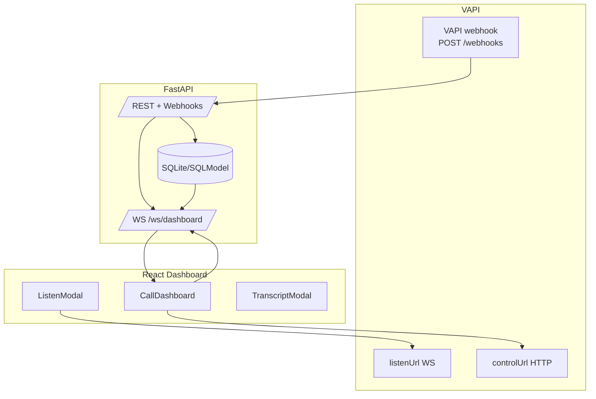
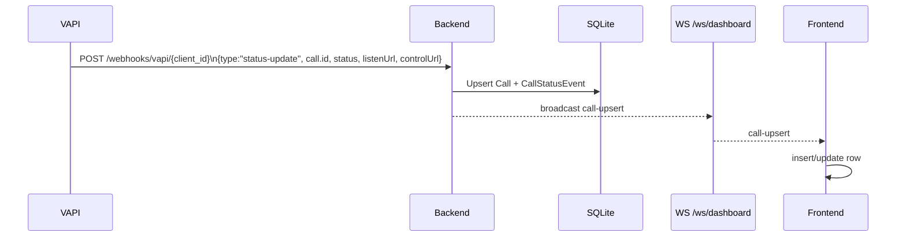
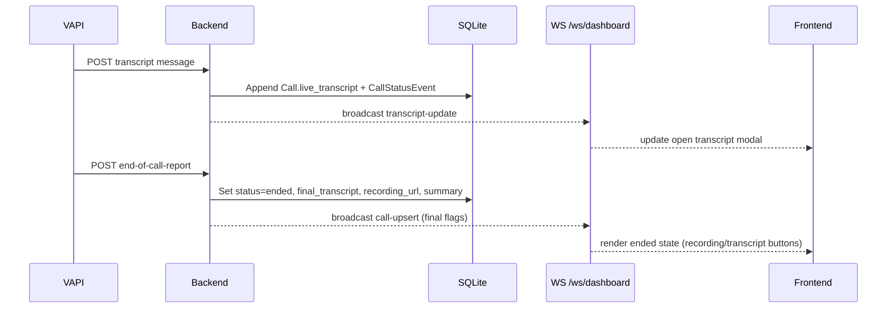
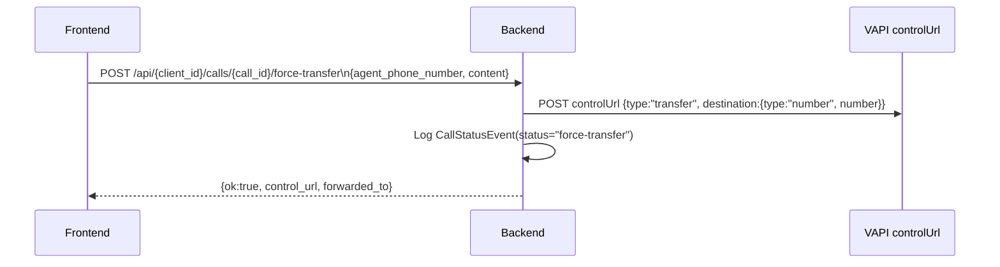

# CallMark AI Inbound Call Dashboard (FastAPI + React)

Real-time monitoring for AI voice agents powered by VAPI.ai. The FastAPI backend ingests VAPI webhooks, persists call state in SQLite via SQLModel, and broadcasts updates over WebSockets. The React + Vite frontend renders a live dashboard with listen-in audio, transcript viewing, and force-transfer controls.

## Repository Map
- **backend/** – FastAPI application with organized structure:
  - `app.py` – Main FastAPI application entry point
  - `database/` – SQLModel models, DB connection (`calls_dashboard.db`)
  - `routers/` – API routes (calls, webhooks, debug, websockets)
  - `services/` – Business logic (call_service, supabase_service)
  - `recordings/` – Local fallback for recordings
- **frontend/** – React + Vite + Tailwind CSS v4 dashboard UI
  - `src/components/` – CallDashboard, TranscriptModal, ListenModal, RecordingModal
- api_docs.md – Existing HTTP/WebSocket reference
- architecture-diagrams.md – Original Mermaid diagrams
- postman_collection.json – Sample requests

## Quickstart
Prereqs: Python 3.11+ (tested with 3.13), Node 20+, npm, SQLite (built-in).

Backend
1) cd backend
2) python -m venv .venv && .\.venv\Scripts\activate
3) pip install fastapi uvicorn sqlmodel httpx
4) python -m uvicorn app:app --reload --port 8000
Notes: Run from `backend/` directory. Startup seeds Client(id="demo-client"). DB lives at `backend/database/calls_dashboard.db`. Delete the file to reset local data.

Frontend
1) cd frontend
2) npm install
3) Set VITE_BACKEND_URL (defaults to http://localhost:8000)
   - Windows: set VITE_BACKEND_URL=http://localhost:8000
   - PowerShell: ="http://localhost:8000"
4) npm run dev -- --host
5) Open the printed dev URL (e.g., http://localhost:5173).

## Environment
- Frontend: 
  - `VITE_BACKEND_URL`: Base URL for backend HTTP + WS (default: `http://localhost:8000`).
- Backend:
  - `DATABASE_URL`: SQLModel database URL (default: `sqlite:///./vapi_dashboard.db`).
  - `SUPABASE_URL`: Supabase project URL for Auth/Storage.
  - `SUPABASE_KEY`: Supabase Service Role Key (for storage signing).
  - `SUPABASE_BUCKET`: Storage bucket name (default: `recordings`).

## Data Model (SQLModel)
- Client: id (pk), name, created_at
- Call: id (pk), client_id (fk Client), phone_number, status, started_at, ended_at, cost, user_id, username, duration, listen_url, control_url, live_transcript, final_transcript, recording_url, summary (JSON), created_at, updated_at
- CallStatusEvent: id (pk), call_id (fk Call), client_id (fk Client), user_id, status, payload (JSON), created_at

## Backend Overview
Stack: FastAPI, SQLModel/SQLite, httpx, WebSockets. CORS is open for all origins.

### Architecture
- **Routers**: Modular route handlers in `routers/` (webhooks, calls, debug, websockets)
- **Services**: Business logic in `services/call_service.py` (webhook processing, call updates)
- **Database**: Models in `database/models.py`, connection in `database/connection.py`
- **Response Models**: Pydantic models in `routers/calls.py` for explicit API contracts

### Lifecycle
- on_startup: `init_db()` creates tables; seeds Client("demo-client") when absent.
- Root/health: GET / returns a message; GET /health returns {"status":"ok"}.

### REST/HTTP Endpoints
- **POST /webhooks/vapi/{client_id}** (in `routers/webhooks.py`)
  - Delegates to `CallService` handlers based on message.type:
    - `status-update`: upsert Call (phone/listen/control/status); mark ended_at when status indicates completion; insert CallStatusEvent; broadcast call-upsert.
    - `transcript`: append transcript text to Call.live_transcript; insert CallStatusEvent; broadcast transcript-update with append + fullTranscript.
    - `end-of-call-report`: mark status="ended", set ended_at, final_transcript, recording_url (downloads and stores locally), summary; insert CallStatusEvent; broadcast call-upsert.
    - anything else: logs as generic CallStatusEvent; no broadcast.
- **GET /api/{client_id}/calls** → `listCalls()` – Returns `List[CallListResponse]`
  - Query Params: `user_id` (optional) to filter by assigned agent.
  - Lightweight response excluding heavy fields (transcripts, summary)
  - Includes computed flags: `hasListenUrl`, `hasLiveTranscript`, `hasFinalTranscript`
- **GET /api/calls/{call_id}** → `detailCall()` – Returns `CallDetailResponse`
  - Full call details including transcripts and summary
- **GET /api/calls/{call_id}/recording** → Get Recording URL
  - Returns a signed URL from Supabase Storage (valid for 24h) or a direct URL if already absolute.
- POST /api/{client_id}/calls/{call_id}/force-transfer
  - Body: { "agent_phone_number": "+1...", "content": "optional message" }
  - Looks up Call.control_url; POSTs {type:"transfer",destination:{type:"number",number:<agent>},content:<content>} to that URL via httpx.
  - Inserts CallStatusEvent(status="force-transfer", payload agent_phone_number/content).
- Debug helpers
  - POST /api/debug/create-test-call/{client_id} � upsert Call with optional call_id/phone_number/status/event_payload, log CallStatusEvent, broadcast call-upsert.
  - POST /api/debug/log-status-event/{client_id}/{call_id} � insert CallStatusEvent(status/payload).
  - GET /api/debug/status-events/{client_id}/{call_id} � list events for a call.

### WebSockets
- /ws/dashboard � registers dashboard clients. Server sends an initial hello. Broadcasts two message shapes:
  - call-upsert
    `json
    {
      "type": "call-upsert",
      "clientId": "demo-client",
      "call": {
        "id": "abc",
        "status": "in-progress",
        "phoneNumber": "+1555...",
        "startedAt": "2025-12-10T07:05:14.195889",
        "endedAt": null,
        "listenUrl": "wss://...",
        "hasTranscript": true,
        "hasLiveTranscript": false,
        "hasRecording": true,
        "finalTranscript": "optional",
        "liveTranscript": "optional",
        "recordingUrl": "optional"
      }
    }
    `
  - transcript-update
    `json
    {
      "type": "transcript-update",
      "clientId": "demo-client",
      "callId": "abc",
      "append": "new line",
      "fullTranscript": "all lines so far"
    }
    `
- /ws/fake-audio � test endpoint; after a hello text frame it streams random 1280-byte binary chunks for ~10 seconds for frontend audio testing.

## Frontend Overview (frontend/src)

### Component Structure (Refactored for Maintainability)
- **App.tsx** – Mounts CallDashboard
- **CallDashboard.tsx** (main component, ~560 lines)
  - Bootstraps calls via `GET /api/demo-client/calls`
  - Opens WebSocket to `${backendUrl}/ws/dashboard`; handles `call-upsert` and `transcript-update` messages
  - Manages state for calls list and modal visibility
  - Includes helper functions: `handleCallUpsert()`, `handleForceTransfer()`, `renderActions()`
  - Actions per call:
    - **Active calls** (in-progress/ringing/queued): Listen, Transcript, Take Over (force transfer to +16504848853)
    - **Ended calls**: Call Recording, View Transcript
- **TranscriptModal.tsx** (~160 lines)
  - Fetches full call details on open (if not already loaded)
  - Shows final transcript for ended calls, live transcript for active calls
  - Displays call summary if available
- **ListenModal.tsx** (~260 lines)
  - Connects to backend WebSocket proxy `/ws/listen/{call_id}`
  - Expects 16-bit PCM mono at 32kHz
  - Applies low-pass filter (6000Hz) + gain reduction (0.8) for audio quality
  - Schedules audio chunks smoothly to avoid gaps
  - Cleans up WebSocket + AudioContext on close
- **RecordingModal.tsx** (~60 lines)
  - Simple audio playback for call recordings
  - Assumes relative URLs and prepends `backendUrl`
- **Styling**: Tailwind CSS v4

## Expected CallMark AI Webhook Payloads (examples)
- Status update
  `json
  {
    "message": {
      "type": "status-update",
      "status": "in-progress",
      "call": {
        "id": "call-123",
        "phoneNumber": "+18005550123",
        "listenUrl": "wss://...",
        "controlUrl": "https://..."
      }
    }
  }
  `
- Transcript frame
  `json
  {
    "message": {
      "type": "transcript",
      "transcript": "Customer: I have a billing question",
      "call": { "id": "call-123" }
    }
  }
  `
- End-of-call report
  `json
  {
    "message": {
      "type": "end-of-call-report",
      "endedReason": "customer_hangup",
      "call": { "id": "call-123" },
      "artifact": {
        "recording": { "url": "https://.../recording.mp3" },
        "transcript": "Full transcript text...",
        "messages": [ { "role": "user", "content": "..." } ]
      }
    }
  }
  `

## Debugging and Local Testing
- Seed data: POST /api/debug/create-test-call/demo-client with body { "status": "in-progress" }.
- Inspect events: GET /api/debug/status-events/demo-client/<call_id>.
- Audio smoke test: point ListenModal to ws://localhost:8000/ws/fake-audio to confirm audio playback pipeline (will sound like static).
- Reset DB: delete backend/vapi_dashboard.db (only if you want a clean slate).

## Operational Notes
- Multi-tenancy: client_id is always a path param; CallStatusEvent requires client_id.
- Force transfer requires Call.control_url to be populated by prior webhooks; backend returns 400 if absent.
- WebSocket backpressure: BroadcastManager drops dead sockets when sends fail.
- Security: Auth is not implemented; add API auth + tenant isolation before production; restrict CORS origins.
- Production DB: swap SQLite for Postgres by updating DATABASE_URL/engine.

## Architecture (Mermaid)
### High-level components

### Status update flow

### Transcript + end-of-call flow

### Force transfer flow

## Suggested Next Steps
- Add auth + tenant scoping for all routes and WebSockets, and tighten CORS.
- Replace SQLite with Postgres for production;
- Parameterize force-transfer agent number in "client-settings" UI/DB instead of the current hard-coded value.
- Surface recording_url in UI (ended call action) and consider exposing a detail endpoint for download/stream.
- Add automated tests around webhook handlers and WebSocket broadcasts.
