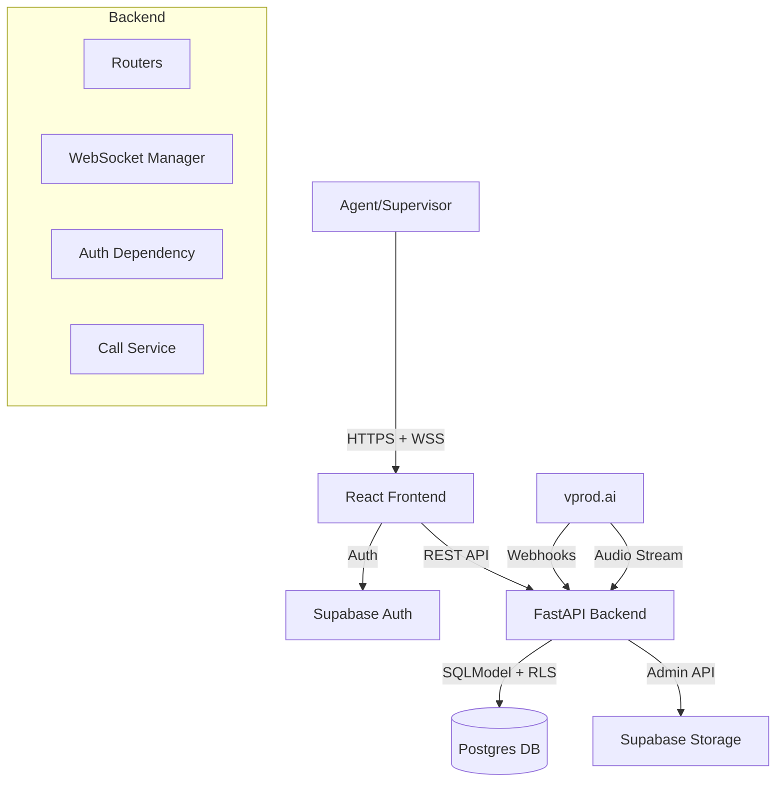
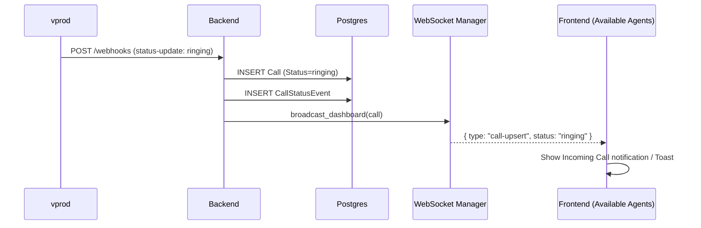
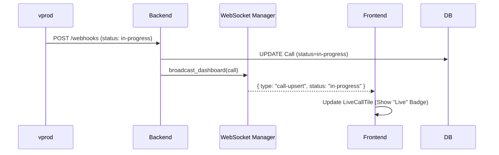
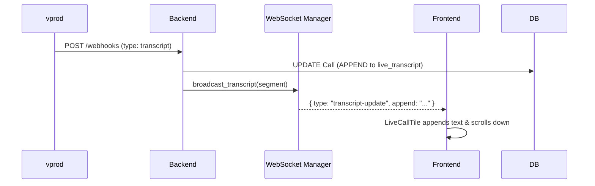
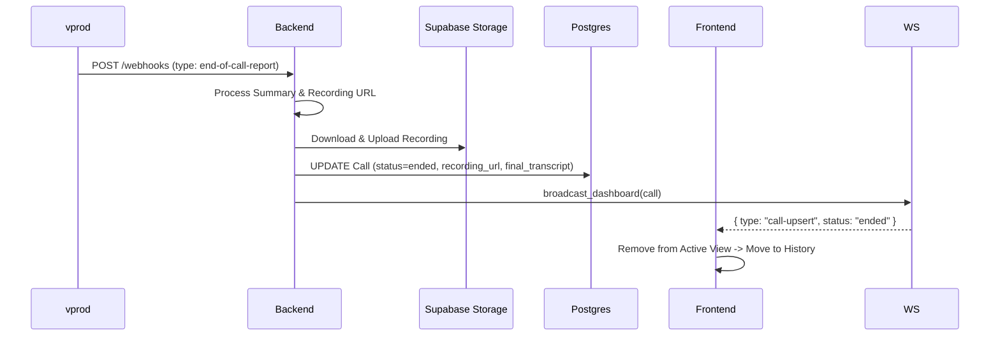
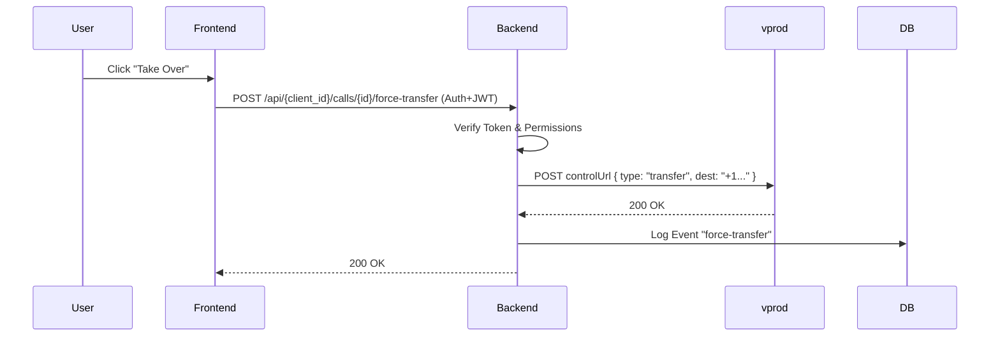

# CallMark AI — Inbound Call Dashboard

> Real-time monitoring for AI voice agents powered by [vprod.ai](https://vprod.ai)

**Navigation** → [Story](#the-story-behind-callmark-ai) | [Live Demo](#live-demo) | [Features](#features-walkthrough) | [How It Works](#architecture--how-it-works) | [Tech Stack](#tech-stack) | [Repo Map](#repository-map) | [Quick Start](#quick-start) | [Data Model](#data-model) | [Security](#architecture--security) | [API Docs](#api-documentation) | [Operations](#operational-notes)

---

## The Story Behind CallMark AI

A Medicare agency came to us with a real problem: how do you cut call center costs without sacrificing the customer experience? Every AI solution they tried had the same failure mode — 2 out of 10 calls would go sideways, leaving distressed customers and a damaged reputation.

**CallMark AI was built to bridge that gap.** Rather than replacing human agents, we elevate them to supervisors. AI handles the routine volume; humans stay in the loop and step in when it matters.

### The Result

- **Up to 70% cost reduction** — fewer agents handling more calls
- **Better customer satisfaction** — human empathy is always one click away
- **Shorter wait times** — AI never goes on break

---

## Live Demo

Try CallMark AI right now by calling one of our live AI agents:

| Use Case | Phone Number |
| :--- | :--- |
| Medicare Inquiries | [938-204-1672](tel:9382041672) |
| Final Expense Insurance | [786-605-3428](tel:7866053428) |
| Personal Loan Inquiries | [938-204-1772](tel:9382041772) |

---

## Features Walkthrough

### 1. Live Call Monitor


Monitor every active call in real-time. Supervisors can listen in and step in when the AI needs a hand.

### 2. Call Logs


Access detailed, searchable logs for every call — perfect for auditing, QA, and agent training.

### 3. Whisper Notes


Send real-time guidance to the AI mid-call with pre-set whisper prompts.

### 4. Feedback Loop


Rate and annotate calls after they end to continuously improve AI performance.

---

## Architecture & How It Works

CallMark AI is built on three layers working in concert:

1. **AI Call Engine** — Handles real-time customer interactions via vprod.ai
2. **Monitoring Dashboard** — Gives supervisors visibility and control over every active call
3. **Feedback System** — Captures human judgment to improve AI behavior over time

### High-Level System Components


```mermaid
flowchart TD
    User[Agent/Supervisor] -->|HTTPS + WSS| FE[React Frontend]
    FE -->|Auth| Supabase[Supabase Auth]
    FE -->|REST API| BE[FastAPI Backend]

    subgraph Backend
        API[Routers]
        WS[WebSocket Manager]
        Auth[Auth Dependency]
        Service[Call Service]
    end

    BE -->|SQLModel + RLS| DB[(Postgres DB)]
    BE -->|Admin API| Storage[Supabase Storage]

    vprod[vprod.ai] -->|Webhooks| BE
    vprod -->|Audio Stream| BE
```

### New Incoming Call Flow


```mermaid
sequenceDiagram
    participant V as vprod
    participant BE as Backend
    participant DB as Postgres
    participant WS as WebSocket Manager
    participant FE as Frontend (Available Agents)

    V->>BE: POST /webhooks (status-update: ringing)
    BE->>DB: INSERT Call (Status=ringing)
    BE->>DB: INSERT CallStatusEvent
    BE->>WS: broadcast_dashboard(call)
    WS-->>FE: { type: "call-upsert", status: "ringing" }
    FE->>FE: Show Incoming Call notification / Toast
```

### Status Update Flow


```mermaid
sequenceDiagram
    participant V as vprod
    participant BE as Backend
    participant WS as WebSocket Manager
    participant FE as Frontend

    V->>BE: POST /webhooks (status: in-progress)
    BE->>DB: UPDATE Call (status=in-progress)
    BE->>WS: broadcast_dashboard(call)
    WS-->>FE: { type: "call-upsert", status: "in-progress" }
    FE->>FE: Update LiveCallTile (Show "Live" Badge)
```

### Live Transcript Update Flow


```mermaid
sequenceDiagram
    participant V as vprod
    participant BE as Backend
    participant WS as WebSocket Manager
    participant FE as Frontend

    V->>BE: POST /webhooks (type: transcript)
    BE->>DB: UPDATE Call (APPEND to live_transcript)
    BE->>WS: broadcast_transcript(segment)
    WS-->>FE: { type: "transcript-update", append: "..." }
    FE->>FE: LiveCallTile appends text & scrolls down
```

### End of Call Flow


```mermaid
sequenceDiagram
    participant V as vprod
    participant BE as Backend
    participant S as Supabase Storage
    participant DB as Postgres
    participant FE as Frontend

    V->>BE: POST /webhooks (type: end-of-call-report)
    BE->>BE: Process Summary & Recording URL
    BE->>S: Download & Upload Recording
    BE->>DB: UPDATE Call (status=ended, recording_url, final_transcript)
    BE->>WS: broadcast_dashboard(call)
    WS-->>FE: { type: "call-upsert", status: "ended" }
    FE->>FE: Remove from Active View -> Move to History
```

### Force Transfer (Supervisor Takeover) Flow


```mermaid
sequenceDiagram
    participant User
    participant FE as Frontend
    participant BE as Backend
    participant V as vprod

    User->>FE: Click "Take Over"
    FE->>BE: POST /api/{client_id}/calls/{id}/force-transfer (Auth+JWT)
    BE->>BE: Verify Token & Permissions
    BE->>V: POST controlUrl { type: "transfer", dest: "+1..." }
    V-->>BE: 200 OK
    BE->>DB: Log Event "force-transfer"
    BE-->>FE: 200 OK
```

---

## Tech Stack

| Layer | Technology |
| :--- | :--- |
| **Frontend** | React + TypeScript + Vite + Tailwind CSS v4 |
| **Backend** | FastAPI (Python) |
| **Database** | PostgreSQL via SQLModel |
| **Auth & Storage** | Supabase (Auth + RLS + Storage) |
| **AI Call Engine** | vprod.ai |
| **Frontend Deploy** | Vercel |
| **Backend Deploy** | Render |

---

## Repository Map

### `backend/` — FastAPI + SQLModel

| Path | Description |
| :--- | :--- |
| `app.py` | Main entry point. Configures CORS, HSTS middleware. |
| `routers/webhooks.py` | Ingests vprod events: `status-update`, `transcript`, `end-of-call-report`. |
| `routers/calls.py` | REST endpoints for listing and retrieving calls. |
| `routers/websockets.py` | Handlers for dashboard updates (`/ws/dashboard`) and audio streaming (`/ws/listen`). |
| `services/websocket_manager.py` | `BroadcastManager` — connection pooling and tenant-based message isolation. |
| `services/call_service.py` | Core logic for upserting calls and processing reports. |
| `services/supabase_service.py` | Interfaces with Supabase Storage for recordings. |
| `services/create_user.py` | **Admin script** for creating users in Supabase Auth & Postgres. |
| `dependencies/auth.py` | JWT validation and RLS context switching. |
| `dependencies/ws_auth.py` | Query-param based auth for WebSocket connections. |
| `database/models.py` | SQLModel definitions: `Call`, `Client`, `CallStatusEvent`, `Profile`. |
| `database/connection.py` | Database session management and engine config. |
| `migrations/` | Alembic migration scripts. |

### `frontend/` — React + Vite + Tailwind v4

| Path | Description |
| :--- | :--- |
| `src/context/ActiveCallContext.tsx` | **Singleton WebSocket manager.** Persists across navigation. See [ActiveCallContext Deep Dive](#deep-dive-activecallcontext). |
| `src/context/GlobalContext.tsx` | User session and theme state. |
| `src/components/Sidebar.tsx` | Layout shell with navigation and real-time active call badge. |
| `src/components/LiveCallTile.tsx` | Real-time card for in-progress calls. Includes `LiveAudioStreamer`. |
| `src/components/LiveAudioStreamer.tsx` | Web Audio API consumer for low-latency audio playback. |
| `src/components/CallDashboard.tsx` | Main data table with filtering and sorting. |
| `src/components/CallDetailSidebar.tsx` | Deep-dive view for transcripts and analysis. |
| `src/pages/LiveMonitorPage.tsx` | "Active Calls" view, subscribes to `ActiveCallContext`. |
| `src/pages/CallDashboard.tsx` | Historical call logs page. |
| `src/pages/LoginPage.tsx` | Supabase Auth login. |

### `recordings/`

Recording assets and upload helpers.

---

## Quick Start

### Prerequisites
- Python 3.11+
- Node.js 20+
- [Supabase Project](https://supabase.com) (Postgres DB + Auth)

### 1. Backend Setup

```bash
cd backend
python -m venv .venv
source .venv/bin/activate  # Windows: .venv\Scripts\activate
pip install -r requirements.txt
```

**Environment Variables (`backend/.env`)**
```ini
DATABASE_URL=postgresql://postgres:[PASSWORD]@[HOST]:5432/postgres
SUPABASE_URL=https://[PROJECT-ID].supabase.co
# Service Key — ONLY for admin scripts & webhooks (bypasses RLS)
SUPABASE_SERVICE_ROLE_KEY=[SECRET-KEY]
# Anon Key — for client-scoped requests (respects RLS)
SUPABASE_ANON_KEY=[PUBLIC-KEY]
```

**Run the server**
```bash
python -m uvicorn app:app --reload --port 8000
```

### 2. Frontend Setup

```bash
cd frontend
npm install
```

**Environment Variables (`frontend/.env`)**
```ini
VITE_BACKEND_URL=http://localhost:8000
VITE_SUPABASE_URL=https://[PROJECT-ID].supabase.co
VITE_SUPABASE_ANON_KEY=[PUBLIC-KEY]
```

**Run the client**
```bash
npm run dev
```

### 3. Creating a User

Use the helper script to create a user in both Supabase Auth and the local Profiles table:

```bash
cd backend
python -m services.create_user
```

Follow the interactive prompts to set email, password, and `client_id` (Tenant ID).

---

## Data Model

### `Client` Table
Represents a Tenant or Organization.

| Column | Type | Description |
| :--- | :--- | :--- |
| `id` | `VARCHAR(PK)` | Manual ID (e.g. `"demo-client"`) |
| `name` | `VARCHAR` | Display name |
| `created_at` | `TIMESTAMP` | Creation time |

### `Profile` Table (`public.profiles`)
Links Auth users to their Client tenant.

| Column | Type | Description |
| :--- | :--- | :--- |
| `id` | `UUID(PK)` | References `auth.users.id` |
| `client_id` | `VARCHAR` | References `Client.id` |
| `role` | `VARCHAR` | `admin` or `user` |
| `username` | `VARCHAR` | Unique username |
| `display_name` | `VARCHAR` | Human-readable name |
| `created_at` | `TIMESTAMP` | |

### `Call` Table
The core record for every voice session.

| Column | Type | Description |
| :--- | :--- | :--- |
| `id` | `VARCHAR(PK)` | vprod Call ID |
| `client_id` | `VARCHAR(FK)` | Tenant reference |
| `phone_number` | `VARCHAR` | Caller's number |
| `status` | `VARCHAR` | `ringing`, `in-progress`, `ended`, `queued` |
| `started_at` | `TIMESTAMP` | Call start time |
| `ended_at` | `TIMESTAMP` | Call end time |
| `duration` | `INTEGER` | Duration in seconds |
| `user_id` | `VARCHAR` | Assigned agent ID |
| `username` | `VARCHAR` | Assigned agent name |
| `cost` | `FLOAT` | vprod cost |
| `listen_url` | `VARCHAR` | WebSocket URL for audio |
| `control_url` | `VARCHAR` | HTTP URL for call controls |
| `live_transcript` | `TEXT` | JSON array (incremental updates) |
| `final_transcript` | `TEXT` | Complete transcript blob |
| `recording_url` | `VARCHAR` | Path in `recordings` bucket |
| `summary` | `JSON` | AI-generated summary object |
| `sentiment` | `VARCHAR` | Overall call sentiment |
| `disposition` | `VARCHAR` | Call outcome (e.g., `"qualified"`) |
| `notes` | `TEXT` | Agent notes |
| `feedback_rating` | `INTEGER` | 1–5 rating |
| `feedback_text` | `TEXT` | Feedback comments |
| `created_at` | `TIMESTAMP` | |
| `updated_at` | `TIMESTAMP` | |

### `CallStatusEvent` Table
Audit log of all call state changes.

| Column | Type | Description |
| :--- | :--- | :--- |
| `id` | `INTEGER(PK)` | Auto-increment ID |
| `call_id` | `VARCHAR(FK)` | References `Call.id` |
| `client_id` | `VARCHAR(FK)` | References `Client.id` |
| `user_id` | `VARCHAR` | Actor (if applicable) |
| `status` | `VARCHAR` | Event status (`ringing`, `ended`, `transcript`) |
| `payload` | `JSON` | Full webhook payload snapshot |
| `created_at` | `TIMESTAMP` | Event time |

---

## Architecture & Security

### Authentication Flow

1. **Frontend**: User logs in via `supabase-js` and receives a JWT (`access_token`).
2. **API Request**: Frontend sends the JWT as `Authorization: Bearer <token>`.
3. **Backend (`auth.py`)**:
   - Verifies the JWT using the Supabase public key.
   - Extracts the `sub` (User ID).
   - Executes `SET LOCAL request.jwt.claim.sub = 'user_id'` and `SET LOCAL role = 'authenticated'` — this ensures all subsequent DB queries run under **Postgres Row Level Security (RLS)**.

### Row Level Security (RLS)

Tenant isolation is enforced at the database level via RLS policies.

- `SELECT` — Users can only see rows where `client_id` matches their Profile's `client_id`.
- `INSERT / UPDATE` — Strictly permitted only for matching tenants or specific services.
- **Service Role** — The `SUPABASE_SERVICE_ROLE_KEY` bypasses RLS and is used *only* for webhook ingestion, background processing, and admin scripts.

### Deep Dive: `ActiveCallContext`

The `ActiveCallContext` is the heartbeat of the frontend's real-time system. It is a **Singleton WebSocket Manager** that persists across page navigations (mounted in `App.tsx`).

**Key responsibilities:**

1. **Connection Management** — Establishes a single `/ws/dashboard` WebSocket on login. Handles reconnection automatically. Authenticates via the Supabase JWT in the connection URL.

2. **Global State Tracking** — Tracks the active call count (`activeCallCount`) for the entire tenant and keeps the **Sidebar Badge** updated in real-time, even when the user is browsing historical logs.

3. **Event Dispatching** — Exposes a `subscribe()` method so individual pages (like `LiveMonitorPage`) can listen for specific events (`transcripts`, `status-updates`). The context owns the *connection*; pages own the *display*.

4. **Global Feedback** — Fires **Toast Notifications** and **Sound Alerts** (Web Audio beep) whenever a new incoming call is detected.

### Real-time Audio Streaming

A dedicated WebSocket endpoint handles low-latency "Listen In" audio.

- **Path**: `/ws/listen/{call_id}?token={jwt}`
- **Flow**:
  1. vprod streams audio to the Backend.
  2. Backend buffers and forwards linear 16-bit PCM chunks to connected frontend clients.
  3. The `LiveAudioStreamer` component uses the **Web Audio API** to schedule and play chunks without jitter.

---

## API Documentation

**Base URL**: `http://localhost:8000` (Development)

### Authentication

All protected endpoints require the Supabase JWT in the `Authorization` header:

```http
Authorization: Bearer <your_access_token>
```

Data access is strictly isolated by `client_id` (Tenant ID) via Postgres RLS. A valid token for Tenant A cannot read Tenant B's data.

---

### Webhooks

#### `POST /webhooks/vprod/{client_id}`

Dispatcher for all vprod.ai server events. **Protected** — requires a secret token.

```http
Content-Type: application/json
Authorization: Bearer <WEBHOOK_SECRET>
```

**Scenario A — Status Update**

Sent when call state changes (e.g., `ringing` → `in-progress` → `ended`).

```json
{
  "message": {
    "type": "status-update",
    "status": "in-progress",
    "call": {
      "id": "vprod-call-uuid-123",
      "customer": { "number": "+15550001234" },
      "listenUrl": "wss://vprod.ai/listen/...",
      "controlUrl": "https://vprod.ai/control/..."
    },
    "timestamp": "2024-01-01T12:00:00Z"
  }
}
```

**Scenario B — Live Transcript**

Sent incrementally as the AI or customer speaks.

```json
{
  "message": {
    "type": "transcript",
    "transcript": "Hello, how can I help you today?",
    "transcriptType": "partial",
    "call": { "id": "vprod-call-uuid-123" }
  }
}
```

**Scenario C — End of Call Report**

Sent after the call finishes processing.

```json
{
  "message": {
    "type": "end-of-call-report",
    "call": { "id": "vprod-call-uuid-123" },
    "artifact": {
      "transcript": "Full final transcript...",
      "recordingUrl": "https://vprod.ai/recordings/file.wav"
    },
    "analysis": {
      "summary": "User asked about billing.",
      "sentiment": "positive"
    },
    "endedReason": "customer-ended-call"
  }
}
```

---

### REST Endpoints

#### List Calls
**`GET /api/{client_id}/calls`**

Retrieve a paginated, filtered list of calls.

| Query Param | Description |
| :--- | :--- |
| `status` | Filter by comma-separated status (e.g., `in-progress,ringing`) |
| `include_content` | `true` to return full transcripts and summaries. Default: `false` |

```bash
curl -X GET "http://localhost:8000/api/demo-client/calls?status=in-progress" \
     -H "Authorization: Bearer <your_jwt>"
```

**Response (200 OK)**
```json
[
  {
    "id": "vprod-call-uuid-123",
    "client_id": "demo-client",
    "phone_number": "+15550001234",
    "status": "in-progress",
    "started_at": "2024-01-01T12:00:00Z",
    "duration": 45,
    "hasListenUrl": true,
    "hasLiveTranscript": true,
    "hasFinalTranscript": false
  }
]
```

---

#### Get Call Details
**`GET /api/calls/{call_id}`**

Retrieve full details for a single call, including the live transcript array and analysis.

```bash
curl -X GET "http://localhost:8000/api/calls/vprod-call-uuid-123" \
     -H "Authorization: Bearer <your_jwt>"
```

**Response (200 OK)**
```json
{
  "id": "vprod-call-uuid-123",
  "client_id": "demo-client",
  "status": "in-progress",
  "live_transcript": [
    { "role": "ai", "text": "Hello!" },
    { "role": "user", "text": "Hi there." }
  ],
  "final_transcript": null,
  "summary": null,
  "sentiment": "neutral"
}
```

---

#### Force Transfer (Supervisor Takeover)
**`POST /api/{client_id}/calls/{call_id}/force-transfer`**

Triggers a transfer to the vprod `controlUrl`. Requires **Admin** role or call ownership.

```bash
curl -X POST "http://localhost:8000/api/demo-client/calls/vprod-uuid-123/force-transfer" \
     -H "Authorization: Bearer <your_jwt>" \
     -H "Content-Type: application/json" \
     -d '{
           "agent_phone_number": "+15559998888",
           "content": "Transferring you to a specialist."
         }'
```

**Response (200 OK)**
```json
{
  "ok": true,
  "call_id": "vprod-uuid-123",
  "forwarded_to": "+15559998888"
}
```

---

#### Get Recording URL
**`GET /api/calls/{call_id}/recording`**

Generates a secure, time-limited signed URL for the recording stored in Supabase Storage.

```bash
curl -X GET "http://localhost:8000/api/calls/vprod-uuid-123/recording" \
     -H "Authorization: Bearer <your_jwt>"
```

**Response (200 OK)**
```json
{
  "url": "https://<supabase-project>.supabase.co/storage/v1/object/sign/recordings/file.wav?token=..."
}
```

---

#### Update Call Metadata
**`PATCH /api/calls/{call_id}`**

Updates editable fields such as notes or feedback ratings.

```bash
curl -X PATCH "http://localhost:8000/api/calls/vprod-uuid-123" \
     -H "Authorization: Bearer <your_jwt>" \
     -H "Content-Type: application/json" \
     -d '{ "notes": "Customer was frustrated.", "feedback_rating": 2 }'
```

---

### WebSockets

#### Dashboard Updates
**`ws://localhost:8000/ws/dashboard?token=<JWT>`**

| Step | Description |
| :--- | :--- |
| Connect | Client sends JWT in the query param |
| Server Hello | Server responds with `{ "type": "hello" }` |
| Subscribe | Client sends `{ "type": "subscribe", "callId": "..." }` for granular updates |
| `call-upsert` | Pushed whenever a call's status or metadata changes |
| `transcript-update` | Pushed when new speech is transcribed |

**Sample `transcript-update` message:**
```json
{
  "type": "transcript-update",
  "clientId": "demo-client",
  "callId": "vprod-uuid-123",
  "append": " I would like to order...",
  "fullTranscript": "Hello... I would like to order..."
}
```

#### Audio Streaming (Listen In)
**`ws://localhost:8000/ws/listen/{call_id}?token=<JWT>`**

The server proxies binary messages from vprod's `listenUrl`.

| Property | Value |
| :--- | :--- |
| Format | Raw PCM 16-bit Little Endian |
| Sample Rate | 24kHz or 32kHz (depends on vprod config) |
| Client-side | Use Web Audio API `AudioContext` to decode and play |

---

### Error Codes

| Status | Description |
| :--- | :--- |
| `200 OK` | Request succeeded |
| `400 Bad Request` | Missing required fields or invalid JSON |
| `401 Unauthorized` | Missing or invalid Bearer token |
| `403 Forbidden` | Valid token, but user lacks access (tenant mismatch) |
| `404 Not Found` | Resource does not exist or is hidden via RLS |
| `500 Internal Error` | Server-side exception |

---

## Operational Notes

- **Bucket Configuration** — Ensure your Supabase Storage bucket is named `recordings`, or update the name in `.env`.
- **CORS** — Currently set to `allow_origins=["*"]` for development. Restrict this in production.
- **Binary Audio** — The Listen endpoint expects raw PCM data. If you change formats, update the decoding logic in `LiveAudioStreamer.tsx` accordingly.

---

## Contributing & Feedback

Found a bug? Have an idea? PRs and issues are welcome. If you're building something with CallMark AI or integrating with vprod.ai, we'd love to hear about it.

---

<div align="center">

Built with care for the humans on both ends of the call. 🤝

*CallMark AI — where efficiency meets empathy.*

</div>
